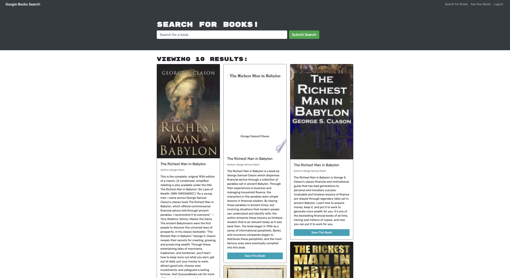
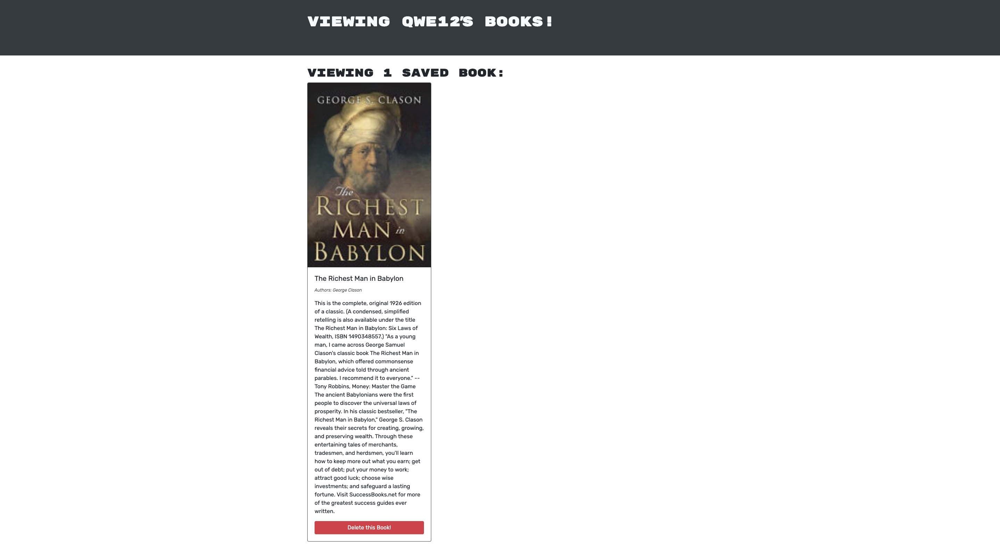

# search_a_book
This is created using the apollo server

## Description

This is a Full-Stack MERN website that is using a google book searching API. The backend and front end are utilised for the user. This app will let you search for a book of your choice, read a little about it and then allow you to save it after you logout using your localstorage

## Tabel of Contents

* [Installation](#installation)
* [Usage](#usage)
* [Contribute](#contribute)
* [Tests](#tests)
* [Screenshots](#screenshots)
* [Technology](#technology)
* [Questions](#questions)

## Installation

In order to run this application, you will need to install the following

- npm run install
- npm run develop

## Usage

In order to use this app, you will need to understand the following;

- Apollo Server
- Express
- JWT
- MongoDB
- API

## Contribute

In order to contribute to this app, you will need to understand the following;

- Apollo Server
- Express
- JWT
- MongoDB
- API

## Tests

To run tests, please use the following command:

- npm run develop

## Screenshots of deployed app

## Technology

- Github
- Javascript
- Apollo Server
- Express
- JWT
- MongoDB
- API
- Heroku

## Questions

Please click the links below

[Github] (https://github.com/kishan254)

Write me on;

[Email] (kishan.gosrani@hotmail.com)

## License

This project is currently licensed under the MIT [License](https://choosealicense.com/licenses/mit/)
